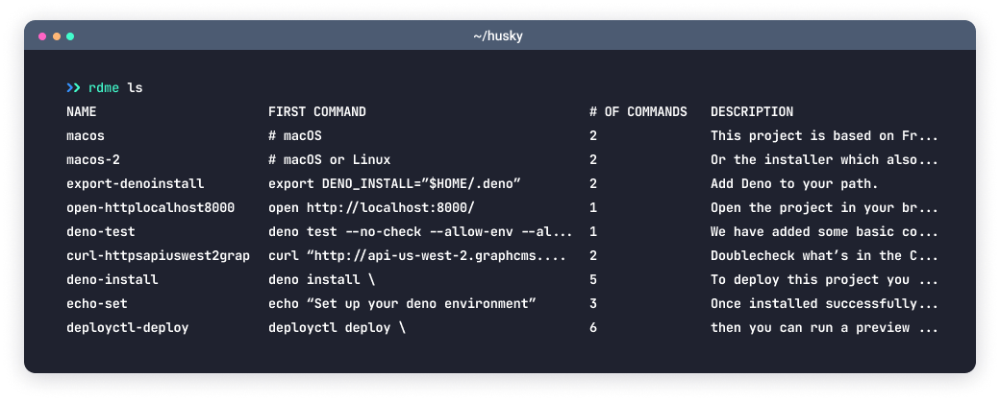
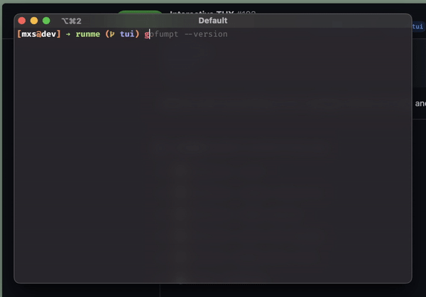

# Runme CLI

Feeling like Runme is great, but you want something even more powerful? Well, lucky for you, there is a Runme CLI!

Runme can be run not only as a VS Code extension but also as a CLI tool to run certain code snippets within your `Readme.md`.

Also, you can parse markdown files and easily run their commands right from the terminal, with no VS Code required.



The Runme CLI is ideal for power users who want to get the absolute most out of Runme.

## Installing

The easiest way on MacOS is to use Homebrew:

```sh
$ brew update
```

Install runme

```sh
$ brew install stateful/tap/runme
```

Alternatively, check out runme's [releases](https://github.com/stateful/runme/releases) and select a binary for your operating system.

If you have Go developer tools installed, you can install it with go install:

```sh
$ go install github.com/stateful/runme@latest
```

### All other platforms

You can find a binary for your OS/arch on our [releases page](https://github.com/stateful/runme/releases). Let us know on [Discord](https://discord.com/invite/BQm8zRCBUY) if you have a preferred distribution mechanism.

See [the doc page on the cli](https://runme-dev-mxsdev.vercel.app/docs/cli) for installation instructions.

## Basic Usage

Runme has a nice TUI that you can use simply like so:



### Warning!

Runme won't work if your current working directory doesn't contain a README file at the top level!

You can use the `--chdir` flag to alter this behavior, without changing the environment's working directory.

(TODO: better gif)

This allows you to quickly execute any script present in the README.

Runme parses every shell or bash code block of a markdown file and allows you to execute it within your terminal environment. It comes with several commands that help you to run code blocks in your markdown successfully:

```sh
    runme --help
    Parses commands directly from a README (best-effort) to make them executable under a unique name.

    Usage:
     runme [command]

    Available Commands:
     completion  Generate the autocompletion script for the specified shell
     help        Help about any command
     list        List available commands.
     print       Print a selected snippet.
     run         Run a selected command.

    Flags:
         --chdir string      Switch to a different working directory before executing the command. (default ".")
         --filename string   A name of the README file. (default "README.md")
     -h, --help              help for runme
     -v, --version           version for runme
```


By default, Runme will try to open a `Readme.md` file in your current work directory but you can modify this by using the `filename` and `chdir` flags, e.g.:

```sh
runme ls --filename SUPPORT.md --chdir ./.github
```

If you want to use RUNME outside VS Code, you can install the CLI as a standalone application. [Read more about runme CLI](https://github.com/stateful/runme)

## Running Script Directly

The TUI is nice, but what if you just want to run a specific command quickly?

To run a specific script by name, use the `runme run &lt;command>` subcommand!
