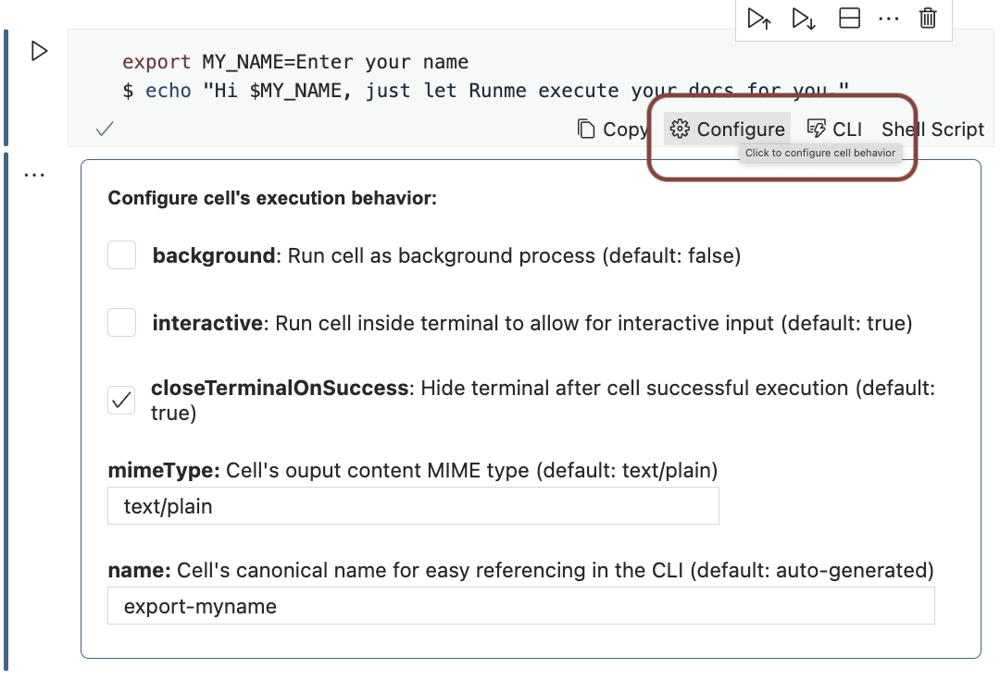

# Cell Configuration

To provide the best possible README (interactive markdown) experience to your users, be sure to configure your document's cells.

## Specify Language in Blocks

Runme, just like most Markdown viewers, will work best without ambiguity about what language is contained inside of fenced code blocks. If possible, always specify the language [according to the standard](https://www.markdownguide.org/extended-syntax/#syntax-highlighting) illustrated below.

```
    ```sh
    $ echo "language identifier in fenced code block"
    ```
```

## Cell Execution

Not all commands are equal and expectations how execution works differs. Most commond cases are:

1. File-watchers for compilers & bundlers should run as background tasks
2. Interactive vs non-interactive execution
3. Human-centric output: JSON, text, images, etc
4. Terminal visibility when no errors occur

Just click "Configure" on the respective cell to make modifications to the cell execution behavior.




Out of the box, Runme will leverage the [Guesslang](https://github.com/yoeo/guesslang) ML/AI model with a bias towards Shell to detect the languages for unidentified code blocks. While this works well in a lot of cases, the accuracy is nowhere near 100%.

## Handle long-running processes

You want to enable the `background` setting if notebook execution will continue indefinitely on a single command.


It is very common to use file-watcher enabled compilers/bundlers (`npm start dev`, `watchexec...` etc) in the background during development. For any cell containing an instance of these commands be sure to tick the "background" cell setting. It prevents execution from permanently blocking the notebook UX. Once ticked notice the "Background Task" label shows up in the cell status bar.


## Interactive vs non-interactive cells

If a cell's commands do not require any input from a reader it might be a good fit to include the cell's output inside the notebook. This is useful if the resulting output could be useful as input in a downstream cell. This is what `interactive=false` is for which defaults to *true*.


Please note that the Runme team is currently working on making output in both notebook & terminal default behavior.

## Terminal visibility post-execution

A cell's execution terminal is auto-hidden unless it fails. This default behavior can be overwritten if keeping the terminal open is in the interest of the Runme notebook reader. Just untick `closeTerminalOnSuccess` (`false`).

## Human-friendly output: JSON, text, images, etc

Not all cells’ output is plain text. Using the `mimeType` specifier it is possible to specify the expected output's type. Notebooks have a variety of renderers that will display them human friendly. The mime type defaults to *text/plain*.


### Supported mime types

Runme supports the standard VS Code mime types alongside custom Runme mime types.

**Standard VS Code mime types**

* text/plain
* application/javascript
* text/html
* image/svg+xml
* text/markdown
* image/png
* image/jpeg

**Mime types for rendering code**

* text/x-json
* text/x-javascript
* text/x-html
* text/x-rust
* text/x-LANGUAGE_ID for any other built-in or installed languages.
