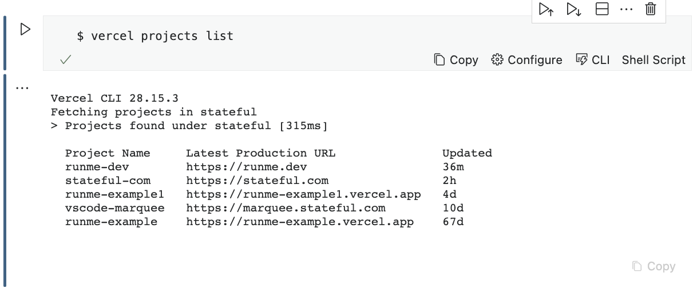
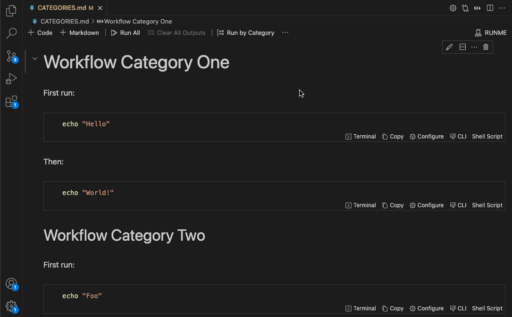

import Infobox from "../src/components/Infobox.tsx"

# Configuration

To get the best of RUNME, and to offer a fantastic README experience, RUNME has a cell configuration option which allows you to indicate how the cell will be executed.

## Document-level Options

RUNME does not just retain frontmatter, it supports top-level settings that will affect all cells in the document.

### Set custom shell

RUNME will default to the system's default shell unless specified in the frontmatter. Both relative (be sure shell is included in `$PATH`) and absolute paths work. This is useful when notebooks are being shared amongst users with different shell setups.

```yaml
---
shell: bash
# or
shell: zsh
# or
shell: /bin/ksh
---
```

### Current working directory

It is not unusual to store docs in a, e.g. `docs/` sub-directory. It's often times implied that commands need running from the base directory. To reliably execute commands in this case it's handy to set explicitly set a working directory in the frontmatter.

```yaml
---
# relative for file inside of `docs/`
cwd: ..
# absolute works too, however, less commonplace
cwd: /tmp
---
```

## Cell-level Options

Not all commands are equal, and expectations of how execution works can differ! For example, code blocks can be to be:

1. File-watchers for compilers & bundlers should run as background tasks
2. Executors for Interactive and Non-interactive programs & scripts
3. Human-centric output: JSON, text, images, etc
4. Terminal visibility when no errors occur

Just click "Configure" on the respective cell to make modifications to the cell execution behavior:


If you feel more comfortable editing the markdown file directly, you can do it by using the following configuration options schema:

```sh
```sh { interactive=false name=echo-hello-world }
echo hello world
```

```sh

Try out the previous command

```sh
echo hello world
```

The entire configuration schema as an example

```sh
```sh { interactive=true name=example mimeType=text/plain closeTerminalOnSuccess=false background=false }
echo hello world ```
```

<Infobox type="sidenote">

Take a look at more [examples](https://github.com/stateful/vscode-runme/tree/main/examples) available inside the VS Code extension repo for a reference on how to apply these code block attributes in different use cases!

</Infobox>

### Specify Language in Blocks

Runme, just like most Markdown viewers, will work best when a script's language is contained inside of fenced code blocks.

If possible, always specify the language [according to the markdown standard](https://www.markdownguide.org/extended-syntax/#syntax-highlighting) as is illustrated below:

```sh
    ```sh
    echo "language identifier in fenced code block"
    ```
```

<Infobox type="warning">

Out of the box, Runme will leverage the [Guesslang](https://github.com/yoeo/guesslang) ML/AI model with a bias towards Shell to detect the languages for unidentified code blocks.

While this works well in a lot of cases, the accuracy is not perfect.

</Infobox>

### Handle long-running processes

It is very common to use file-watcher enabled compilers/bundlers (`npm start dev`, `watchexec...` etc) in the background during development.

For any cell containing an instance of these commands be sure to tick the "background" cell setting. This will prevent execution from permanently blocking the notebook UX.


Once ticked notice the "Background Task" label shows up in the cell status bar!

**Default:** `false`

**Example**

    ```sh { background=true }
    npm run watch
    ```

### Cell's current working directory

In most cases, you probably want to set the current working directory at the document-level, however, it is possible to set it per cell.

    ```sh { cwd=.. }
    npm run watch #relative path
    ```
    
    ```sh { cwd=/tmp }
    echo "absolute path" > dummy_file
    ```

<Infobox type="warning">

Please note that if both `cwd` are set for doc-level and cell they don't overwrite they combine. E.g. `cwd: /tmp/dummy` (doc) and `cwd: ..` (cell) will result in `/tmp`.

</Infobox>

### Interactive vs non-interactive cells

If a cell's commands do not require any input from a reader it might be a good fit to include the cell's output inside the notebook. This is useful if the resulting output could be useful as input in a downstream cell. This is what `interactive=false` is for, and it defaults to *true*.



**Default:** `true`

**Example**

    ```sh { interactive=false }
    openssl rand -base64 32
    ```

<Infobox type="sidenote">

Please note that the Runme team is currently working on making output in both notebook & terminal default behavior.

</Infobox>

### Set environment variables

If a cell has exported variables, the user will be prompted to set these variables. This can be useful to have a parameterized cell while not needing to manually modify the cell.


**Default:** `true`

**Example**

    ```sh { promptEnv=true }
    export SLEEP_SECS=0
    sleep $SLEEP_SECS
    ```

### Terminal visibility post-execution

A cell's execution terminal is auto-hidden unless it fails. This default behavior can be overwritten if keeping the terminal open is in the interest of the Runme notebook reader. Just untick `closeTerminalOnSuccess` (`false`).

**Default:** `true`

**Example**

    ```sh { closeTerminalOnSuccess=false }
    docker ps | grep runme/demo:latest
    ```

### Human-friendly output

JSON, text, images, etc. Not all cells’ output is plain text. Using the `mimeType` specifier it is possible to specify the expected output's type. Notebooks have a variety of renderers that will display them human friendly. The MIME type defaults to *text/plain*.


See below for the list of supported MIME types!

### Exclude Cell from Run All

Every VS Code notebook allows to run all available cells. This can be useful if you define a complete runbook in your markdown file and it allows developers to just click the "Run All" button to get set-up and running. However sometimes certain cells should be excluded from this workflow. With the `excludeFromRunAll` option you can configure this behavior.

**Default:** `false`

**Example**

    ```sh { excludeFromRunAll=true }
    # Do something optional here
    ```

### Run All Cells by Category

If you have multiple workflows in a single markdown file you can categorize them and allow your developers to run all cells by a certain category. To enable that you can add a category as cell option. A cell can have one or multiple categories that are comma seperated.

**Default:** `""`

**Example**

    ```sh { category=build }
    # Do something here
    ```
    
    ```sh { category=build,deployment }
    # Do something here
    ```



## Reference

Everything in one place.

### Document Options

Frontmatter in yaml, json, or toml on top of markdown document.

| Configuration  | Description                              | Default value             |
| ------------- | ----------------------------------------- | ------------------------- |
| cwd           | Overwrites the default working directory  | [markdown file's basedir] |
| shell         | Overwrites shell with custom preference   | [system/user default]     |
| skipPrompts   | Bypasses interactive prompts              | [system/user default]     |

> **SkipPrompts**: This feature can be used to prevent prompting when exporting an environment variable. By configuring the cell options appropriately, you can streamline your workflow and make your environment setup more efficient.

### Cell Options

Metadata inside markdown's fenced code blocks.

| Configuration          | Description                                                     | Default value            |
| ---------------------- | --------------------------------------------------------------- | ------------------------ |
| background             | Indicates if the cell should be runned as a background process  | false                    |
| closeTerminalOnSuccess | Hide Terminal after cell successful execution                   | true                     |
| category               | Execute this code cell within a category                        | [empty]                  |
| cwd                    | Modify current working directory for cell execution             | [empty]                  |
| excludeFromRunAll      | Prevent executing this cell during the "Run All" operation      | false                    |
| interactive            | Indicates if run should allow interactive input                 | false                    |
| interpreter            | The program or command line inserted into shebang (aka #!) line | inferred from languageId |
| mimeType               | Cell’s output content MIME type                                 | text/plain               |
| name                   | Cell’s canonical name useful for referencing the cell via CLI   | auto-generated           |
| terminalRows           | Number of rows to display in the notebook terminal              | auto-set                 |
| promptEnv              | Prompt user to set exported environment vars                    | true                     |
| skipPrompts            | Bypasses interactive [prompts](/configuration) that require inputting environment vars or authentication confirmations. |false     |

### Supported MIME types

Runme supports the standard VS Code MIME types alongside custom Runme MIME types.

**Standard VS Code MIME types**

- text/plain
- application/javascript
- text/html
- image/svg+xml
- text/markdown
- image/png
- image/jpeg

**MIME types for rendering code**

- text/x-json
- text/x-javascript
- text/x-html
- text/x-rust
- text/x-LANGUAGE_ID for any other built-in or installed languages.
