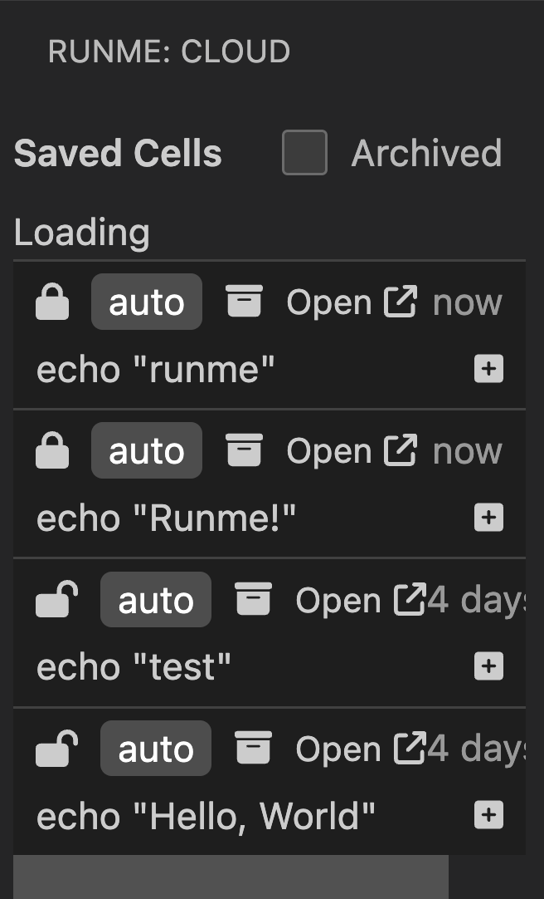

---
runme:
  id: 01HGAP763P40ATQQN75RMGW6XJ
  version: v2.0
sidebar_position: 3
title: Archiving Feature
---

The archiving feature in Runme allows users to hide outputs generated from markdown cells, reducing clutter and preserving outputs for future reference. It leverages the [Runme Cloud](https://app.runme.dev/welcome), ensuring secure and accessible storage. Runme Cloud storage encrypts the stored data both at rest and in transit, which ensures that the data is end-to-end encrypted.

## How To Use Archiving Feature

**Auto-Save or Manual Save**: To archive outputs in Runme, the outputs generated need to be saved. Clicking the Save icon saves the outputs manually. You can also enable [Auto-Save](../configuration/auto-save) to remove the manual saving.

The archiving feature is available via the VS code extension and the Web.

## Archiving via Web

To access [saved](../configuration/auto-save) cells, click on the [share button](https://app.runme.dev/getting-started) on your code block, a link will pop up to navigate you to the Runme Cloud Web interface.

> Please share link with caution. Anyone with the link has access. Click "Open" to toggle visibility.

### Initiating Archiving

1. First, ensure your cell executions are [saved](../configuration/auto-save)
2. Click on the specific cell you wish to archive. Within the cell options, select the designated archive option.
3. You will see a popup stating whether you want to archive the cell or not. Select 'Yes' to archive the cell.

> The above image shows that the cell has been archived successfully

## Archiving via VS code Extension

To access the saved cells you want to archive via [VS code](../getting-started/vs-code), Click on the Runme icon. a view will pop-up to access the Runme Cloud.

### Initiating Archiving

1. Click on the specific cell you wish to archive. Within the view, select the designated archive option.

   
   

2. Confirm the action to archive the cell.

