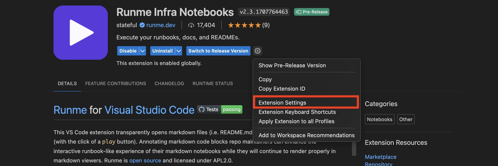

---
runme:
  id: 01HFRZ3233HSQ0NVJB9BE682G5
  version: v2.0
sidebar_position: 3
title: Auto-Save Feature
---

Runme provides an easy and effective way to manage your records and outputs throughout your deployment. With the frequent changes, that occur in a cloud infrastructure deployment process, it is easy to lose track over time and we understand this.
The Runme autosave feature automatically records and tracks every change and activity in your deployment process without any manual intervention to keep you updated and enhance team collaboration.

## **Getting Started with Autosave**

Runme autosave feature goes beyond saving commands and running shell scripts. It is super helpful when automating tasks with changing or inconsistent instructions. Think of handling tasks that change each time or require information gathering at each step. Runme notebooks step in to manage these tasks, providing a consistent and standard way to run automated processes, and keeping you informed at every step.

### Session Outputs

When auto-save is enabled,that is turned on, Runme captures a complete copy of the original Markdown document along with all cell outputs generated during the notebook's execution using the “**Runme Session Outputs**”.


The information includes when each cell was ran, the time it took, and exit codes. Additional contextual metadata like hostname and username are also saved to the Session Outputs file. Runme also captures non-text mime types like images (base64 encoded) outside of textual output produced by terminals.

see an example below:

```sh {"id":"01HPGQH3SV6HM949W7RHC4P563"}
$ terraform workspace select staging

# Ran on 2024-02-09 15:09:08-05:00 for 1.286s exited with 0
Switched to workspace "staging".
```

The session outputs are written per Runme session, which is saved throughout the lifetime of the window running the runbook until it is reset via **Reset Session** in the notebook UX.


If there are more forms you like to be added, kindly [let us know](https://github.com/stateful/runme/issues/new). We are open to incorporating your requests.

### Why Separate Session Outputs?

You might wonder why we have chosen to create a separate Session Outputs file instead of embedding outputs directly into the markdown document. Well, here are our reasons:

1. **Promote Generality for Collaboration**: We believe that cells, including their code and commands (inputs), should remain generic to facilitate collaboration and sharing of notebooks with others. This approach is particularly important for version control-tracked files.
2. **Avoid Version Control Errors**: Separating files prevents accidental inclusion of outputs into version control, reducing the risk of overwriting historical artifacts from previous sessions if they were stored in the same file.
3. **Enhance User Experience (UX)**: Session files with outputs are not directly opened in the notebook UX. After writing the output, Runme may struggle to distinguish between input and output parts of a cell. Instead, the UX will prompt you to open the original document (which requires colocation in the same folder) as a notebook or launch the markdown previewer to display the Session Outputs.

While we are contemplating the possibility of transparently opening Session Outputs files in the future, this may inevitably involve reformatting the original source file as part of the de-/serialization process.

<br />
<Infobox type="sidenote" title="output session">
It is strongly recommended that you do not deploy the session output files to your version control. you can .gitignore the files to ensure that it doesn't get deployed.
</Infobox>


<Infobox type="sidenote" title="Join Runme community!">

Make sure to [get in touch](https://discord.gg/runme) with us if you are missing a feature or have other ideas.

</Infobox>

## **How to Enable Auto-Save**

- Toggle Auto-Save On/Off: On your `.md` file, you have the flexibility to easily turn the Auto-Save feature on or off. This can be done directly from the top of your Markdown (`.md`) file. A simple toggle switch allows for easy control, ensuring that you can activate or deactivate Auto-Save as per your workflow requirements.


- Alternatively you can set autosave on as the default setting.This way, you won’t need to manually enable it every time.

### Set Autosave as Default

By default, session output is turned off, indicated by the autosave button at the top bar displaying `off`. If you want to use the session output feature you can easily turn it on using the autosave button to toggle the feature `(on)` or `(off)`. Alternatively, you can change the session outputs default to be permanently `on` by adjusting the settings. See the guide below to set the autosave on as the default settings

- Begin by navigating to the extension settings in the Runme interface. This is typically found in the toolbar or under a settings menu.



- You can search “autosave” to easily navigate to the Auto-save section.
- To set it as default, select “Yes” to enable this feature as a default.


This action configures the system to automatically save the output of each cell execution.

> 💡 If you’re logged into the Cloud (prompt whenever Auto-Save is toggled on) cells will both be stored locally in a Session Outputs file and securely stored in your dashboard for later review or sharing with others. This is completely optional and if desired can be turned off (follow “Open Settings” in prompt).


