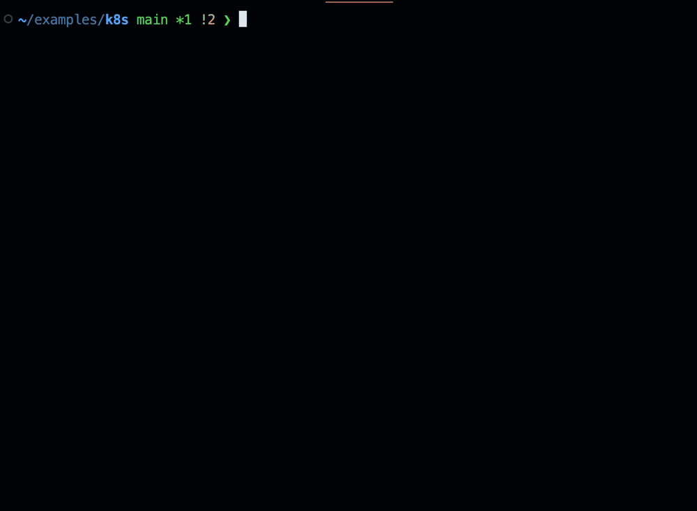

import Infobox from "../../src/components/Infobox.tsx"
import EnvironmentOptions from "../../src/components/EnvironmentOptions.tsx"

# Getting started with Runme CLI

<Infobox type="sidenote" title="Install Runme">

If you haven't already installed Runme CLI, please complete the steps in [installation](/install) before proceeding.

</Infobox>

Runme has a nice TUI that you can use simply like so:

```sh
# short for "runme tui"
$ runme
```



This allows you to quickly execute any script present in the README.

<Infobox type="warning" title="Warning!">

Runme won't work if your current working directory doesn't contain a README file at the top level!

You can use the `--chdir` flag to alter the working directory or `--filename` to specify any other markdown file, without changing the environment's working directory.

</Infobox>

### Available commands

Runme parses every shell or bash code block of a markdown file and allows you to execute it within your terminal environment. It comes with several commands that help you to run code blocks in your markdown successfully:

```sh
Parses commands directly from a markdown (e.g. README) to make them executable.

Usage:
  runme [flags]
  runme [command]

Available Commands:
  branch      Suggest a branch name (aka branchGPT)
  completion  Generate the autocompletion script for the specified shell
  fmt         Format a Markdown file into canonical format
  help        Help about any command
  list        List available commands
  login       Log in to Runme
  logout      Log out from Runme
  print       Print a selected snippet
  run         Run a selected command
  suggest     Use our suggestion engine to give contextual advice
  tui         Run the interactive TUI

Flags:
      --allow-unknown     Display snippets without known executor (default true)
      --background        Enable running background blocks as background processes
[...]
```

### Run a markdown file

By default, Runme will try to open a `Readme.md` file in your current work directory but you can modify this by using the `filename` and `chdir` flags, e.g.:

```sh
runme ls --filename SUPPORT.md --chdir ./.github
```

### Running Commands Directly

The TUI is nice, but what if you just want to run a specific command quickly?

To run a specific script by name, use the `runme run <command>` subcommand.