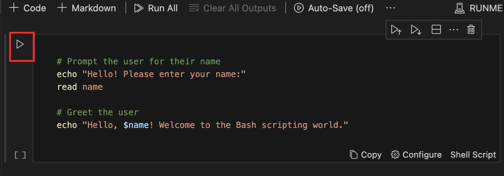
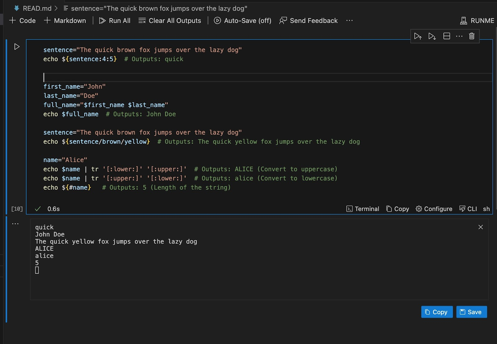
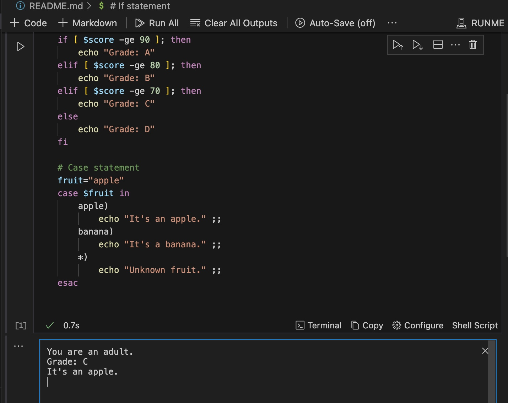
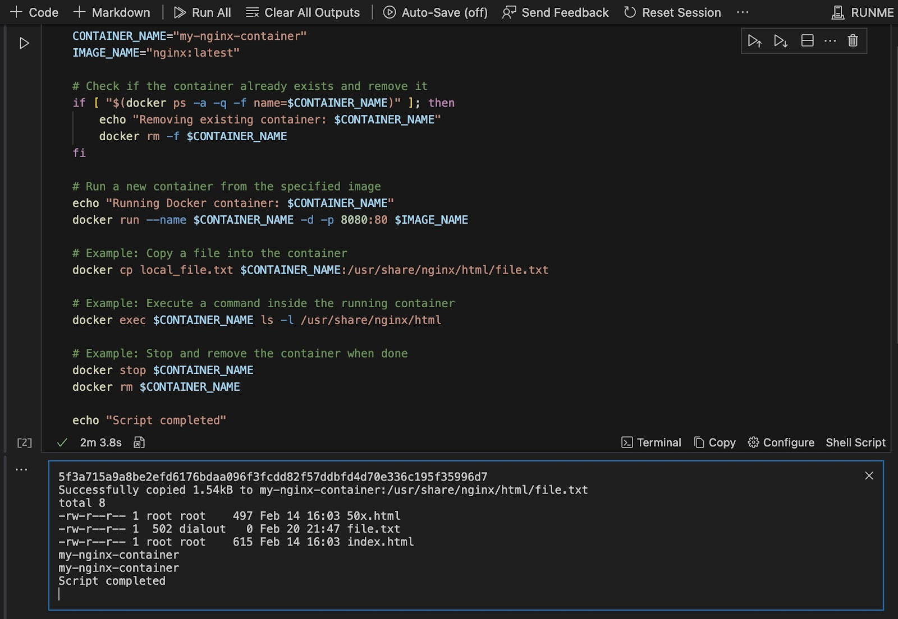

# Running Bash Scripts in Runme

As a system administrator, DevOps engineer, or developer, dealing with Bash scripts to automate tasks is a common part of your daily routine. To run Bash scripts conventionally, you need to create a `.sh` file for your scripts and ensure it begins with a shebang line (`#!`) to specify the interpreter.

All these processes can be made easier with Runme.  [Runme](https://runme.dev/) provides a convenient way to run scripts, code, and commands directly within Markdown files without having to worry about environment configurations.

In this guide, we will walk you through executing Bash scripts on Runme.

## **Setting Up Your Environment**

To get started with Bash scripts in Runme, you need to first install and configure Runme for VS Code. Follow the steps below to perform this task:

- Install VS Code on your local machine
- Proceed to the extension tab of your VS Code dashboard which is on the left and search for Runme.
- Now click install

## **Writing Your First Bash Script in Runme**

Runme integrates easily with Bash scripts via the [Shebang](https://docs.runme.dev/configuration/shebang) feature to execute them directly within Markdown files. The Shebang feature not only makes executing easier but also ensures complex processes are made simpler.
In this section, we will provide you with a step-by-step guide to creating a simple bash script within a Markdown file and executing it with Runme.

1. Create a new folder and open it with your VS code. In your VS code, create a new README.md file.
2. Click on the + Code icon

3. Enter the script you want to run. For this tutorial, we will be using the simple bash script below.

4. Click on Select Cell Language Mode and search for Shell script.

5. Now click on the Run button beside your script to execute it.

You have successfully executed your first bash script with Runme

Now you have seen how Runme makes this easy. Previously, to execute bash scripts, you would have to create a .sh   file, but with Runme, you don’t need to create a new file or any other complex stuff. All you need to do is install the Runme extension in VS Code and save yourself the stress of environment issues as bash scripts run swiftly in Runme regardless of the environment and operating system of your machine.

## **Advanced Bash Scripting Techniques in Runme**

Bash scripts have several advanced techniques that can also be integrated with Rume for  DevOps engineers and SREs. In this section, we will explore some of the advanced features of bash scripting and how they can be integrated with Runme.

Shall we?

* **Variable Manipulation**
   Variable manipulation, which involves modifying or extracting parts of a variable’s value to suit your needs without changing the original data, can be done and executed in your Markdown file without any external dependencies. The image below gives an example of how a user can perform variable manipulation of Bash scripts in Runme and the corresponding output the user will get in the terminal.

* **Conditional Statements**
   Suppose you have a series of conditional statements in a Bash script that you would love to execute, Runme makes this easy for you. All you need to do is create a READMe.md file in VS Code, enter your script, and click the run cell button. The image below is an example of how a conditional statement in Bash script is executed using Runme in VS Code.

* **Integrating Runme with Docker**
   You can use Runme to write several bash scripts that execute commands in Docker. For example, the script below manages a Docker container for an Nginx web server.

* **Strategies for leveraging Runme’s features**
   Efficiency, reliability, and scalability are three paramount keys to thriving in the site reliability engineering and DevOps space.
   Leveraging Runme's features can provide these three keys and also significantly enhance the management and execution of Bash scripts, thereby simplifying your tasks and workflows. Here's how you can optimize Bash scripts for SRE tasks using Runme's key features:

1. Archiving for Historical Reference and Audit Trails
   Runme has an archiving feature that offers a structured approach to storing outputs generated from executed code. With this feature, you can create historical records and audit trails of previous script executions.
   This feature also comes in handy for troubleshooting and performance analysis purposes. In addition, archived outputs are securely stored in the Runme cloud, which ensures accessibility and data integrity.
2. Lifecycle Identity for Versioning and Tracking
   Runme’s lifecycle identity for versioning and tracking allows DevOps engineers and SREs to assign unique identifiers and versions to cells. This facilitates easy version control and tracking of script modifications over time.

   This feature greatly offers ease to users as monitoring of changes, identification of issues, and maintenance of documentation integrity become easier. By adopting lifecycle identity, Bash script execution becomes more manageable and maintainable.

3. Shebang Support for Seamless Integration and Execution
   Runme's Shebang support enables the swift integration and execution of Bash scripts within Runme's environment. With this feature, SREs can specify the desired interpreter version and environment configurations directly within the script. This ensures consistency and compatibility across different environments, making Bash scripts more portable and reusable. Additionally, shebang support simplifies the execution process, allowing SREs to focus on the core tasks without worrying about setup or compatibility issues.
4. Auto-save feature and separate session outputs
   The auto-save feature provides a uniform approach to task automation by ensuring that the history of the Markdown text and all cell output produced while running your file are preserved without manual intervention from you or your teammates.

The auto-save feature incorporates a separate session output method that securely saves when each cell was run, the time it took, and exit codes.

Note: When working with this feature, you are not to push the session outputs to git or any version control software as they have sensitive details.

By strategically incorporating these features into Bash scripts, SREs can enhance productivity, reliability, and scalability in managing infrastructure and ensuring service availability. Whether it's troubleshooting incidents, automating routine tasks, or optimizing system performance, Runme empowers SREs to tackle challenges with confidence and efficiency.

## **Conclusion**
Using Runme to execute your Bash scripts makes execution time faster and provides more ease for you. In this tutorial, we considered how you can execute your first bash script in Runme, advanced Bash scripts you can execute in Runme, and lastly, features in Runme that make the execution of tasks as an SRE expert, DevOps engineer, or system administrator easier.
You can take a look at our [tutorial page](https://docs.runme.dev/guide/) to find out more ways you can use Runme to make your task seamless.

