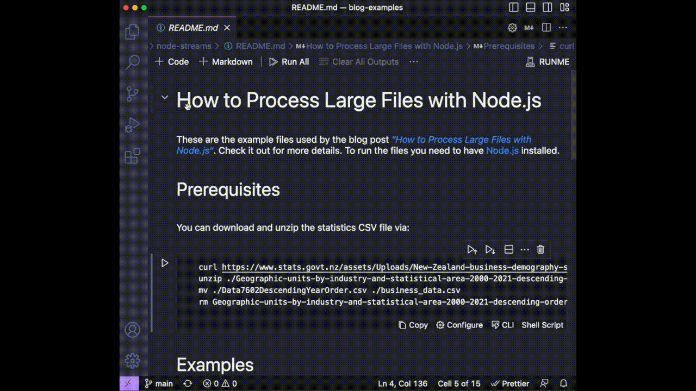

# Runnable Tutorial Straight From Your Blog Post

As a developer, you may often find yourself writing and reading technical blog posts, GitHub project READMEs, Stack Overflow answers and developer documentation. Have you ever wished you could click a link within any of them to launch a VS Code environment and automatically run the commands? This is a useful (and easy) way to verify that all the commands in the project are correct and the outputs/responses make sense. Also, if you have code examples this is a great way to help people quickly check them out and start experimenting.

**With our latest release, you can do just that!**

Let’s take for example the blog post “[How to Process Large Files with Node.js](https://stateful.com/blog/process-large-files-nodejs-streams)” which is one of our most popular blog posts.

If you click the link “[Launch the demo project locally](vscode://stateful.runme?command=setup&repository=git@github.com:stateful/blog-examples.git&fileToOpen=node-streams/README.md)” as shown below, you will be able to run the commands inside VS Code.




A lot of the examples you find for frameworks, blog posts and tutorials are not really usable because they require a lot of context and setup, for example; downloading packages and setting up the required environment. Runme can take away this pain.

With Runme you can click a button instantly clone into a repository for your users, allow them to install the dependencies, and run that specific example out of the box without much setup - making your content much more accessible to your users.

## How does it work?

You start by crafting a link that launches VS Code with all the desired details to successfully clone the project into your local file system. Next, it'll use the Runme extension to open the specified markdown file and render the runnable notebook. This mechanism uses the built in VS Code deep linking functionality that knows how to intelligently launch VS Code into a specified state. Along the way, VS Code will ask your permission and trust anytime it's touching your filesystem, auth or anything else sensitive.

Let’s see the link:


```sh {"id":"01HQ2JT43P80CW88PJXTWTGVDP"}
vscode://stateful.runme?command=setup&repository=git@github.com:stateful/blog-examples.git&fileToOpen=node-streams/README.md
```

If you don’t want to use Github you can directly use a markdown link:


```sh {"id":"01HQ2JWRN06G0560GXWE41Z2WN"}
vscode://stateful.runme?command=setup&fileToOpen=your-markdown-file.md
```

By clicking the link, you will be able to see the README.md file with a ▶️ button next to the code.


And that’s it! Now you can make all your blog posts, GitHub project READMEs, Stack Overflow answers and developer documentation available with a click in VS Code.

**Note**: the repository will be in a temporary directory by default, but you can set it up in VS Code by going to: code > preferences > settings > Look for the Runme extension, and give it a specific path.


