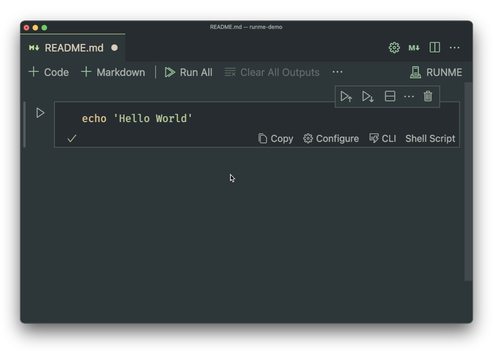

import Infobox from "../../src/components/Infobox.tsx"

## Next.js App on Vercel

This example can be found in the `vercel` sub-folder. You can manually check out this example by [opening it with Runme](https://runme.dev/api/runme?repository=https%3A%2F%2Fgithub.com%2Fstateful%2Fvscode-runme.git&fileToOpen=examples%2Fvercel%2FREADME.md).

### Setup/Environment

Similar to the last example, we can do our setup, starting, and opening of the web browser using Runme:

In a future version of Runme, we'd like to support "execution groups," so that you can execute all of the above scripts in one go!

### Authentication

Interactive terminals are perfect for providing a CLI login to the user:

### List Projects

Remember, cells can capture the output of commands in non-interactive mode!

In this case, this can be used to get a list of the user's current registered projects with the Vercel platform.

