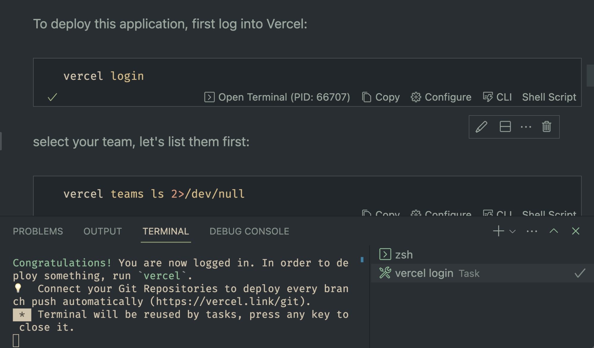
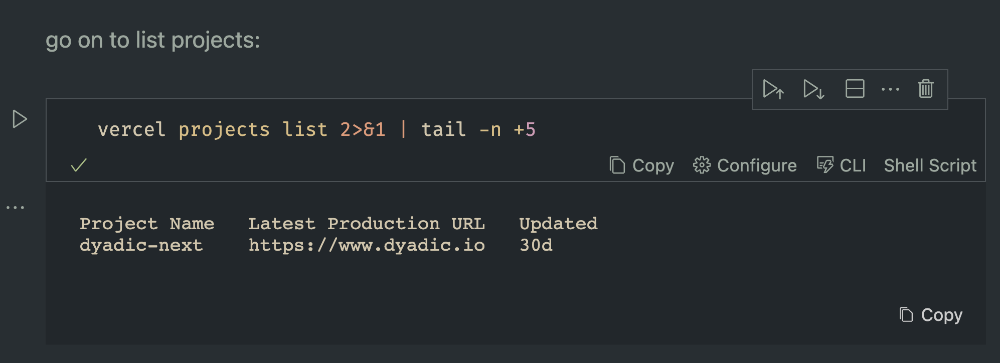

import Infobox from "../../src/components/Infobox.tsx"

This example can be found in the `vercel` sub-folder. You can manually check out this example by [opening it with Runme](https://runme.dev/api/runme?repository=https%3A%2F%2Fgithub.com%2Fstateful%2Fvscode-runme.git&fileToOpen=examples%2Fvercel%2FREADME.md).

### Setup/Environment

Similar to the [previous section](https://docs.runme.dev/integrations/deno-fresh), we can do our setup, starting, and opening of the web browser using Runme:

Runme supports Cell Run Grouping which allows you to execute all the scripts at a go! This can be used in the script above.

### Authentication

Interactive terminals are perfect for providing a CLI login to the user:

### List Projects

Remember, cells can capture the output of commands in non-interactive mode!

In this case, this can be used to get a list of the user's current registered projects with the Vercel platform.

