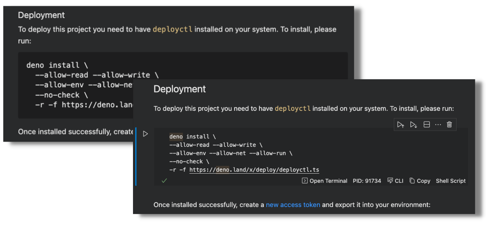

Thank you for interest in Runme 💟!

Runme strives to provide a great experience right out of the box. Please continue to learn how to get the most out of our docs via Runme. In fact, why not use Runme to learn about Runme?

A well-written README can significantly impact your open-source project or reduce your employee's onboarding time for your private repositories. On the other hand, a poorly written README can affect the visibility of your project, even if you think it is an excellent piece of software. For newcomers, it can quickly become a very frustrating experience.

We believe that even if you have an excellent README file, by encouraging your users to view it through the lens of RUNME, the experience will be a game changer.

# What is Runme? 🤔​

Runme is a [VS Code extension](https://marketplace.visualstudio.com/items?itemName=stateful.runme) that aims to provide developers the ability to navigate around any code repository by making Readme markdown files interactive and smart. It consists of two major parts:

* A [CLI tool](https://github.com/stateful/runme) that understands markdown and allows you to discover and run code snippets within it
* A [VS Code extension](https://marketplace.visualstudio.com/items?itemName=stateful.runme) that integrates these capabilities into VS Code and allows you to run markdown through a notebook UI

🏃 Runme allows you to craft dev-native markdown files and create an interactive runbook experience for VS Code.

🙌 It is an open-source tool building on the developer norm of using [README.md](http://README.md) as an entry point to a code repository.

📜 It lets you seamlessly turn your existing Markdown docs, such as README.md, into runnable notebooks.

⏯ It enables static docs to become interactive for its readers and greatly improves their learning experience.

🙆 Runme is a human-centric approach to providing and consuming code repository documentation. It's designed to progressively bridge the widening developer experience gaps in a cloud-native age. Gaps such as:

* Low integration between building blocks employed to deliver apps and services
* Error-prone copy&paste-management of dev environments
* Docs that have fallen behind undetected
* The vault lines of commonplace tools were designed for machines, not humans.

Runme’s purpose is to enable developers to achieve a functional local development environment quickly, starting with copy&paste, click to run commands, and many more features. While [README.md](http://README.md) is the most well-known, there are several other markdown files often found in a repo that you may encounter, including;[ BUILD.md](http://BUILD.md), [CONTRIBUTING.md](http://CONTRIBUTING.md), and many more. Runme supports most .md and .mdx files!

Runme is available both as a VS Code extension and a CLI - but they share the same execution engine to enable a consistent experience. The extension is currently only available for VS Code-compatible platforms including VS Codeium and Codespaces.

Make sure to [get in touch](https://discord.gg/BQm8zRCBUY) with us if you are missing a feature or have other ideas. You can review development progress in [Runme's roadmap](https://github.com/stateful/runme/projects).

👩‍💻 As a VS Code user, just click here to _leverage Runme to run through this getting started guide_.

# Why Runme?

While markdown docs are ubiquitous in software and the written word is fundamental to documentation, bit-rot and "broken docs'' are all too commonplace. The low coupling between the documentation's static text and the code of the documented system exposes our docs to breakage. Runme is here to address this fundamental problem. Runme's goal is to make existing markdown docs both runnable and subsequently testable. Much in the same way unit tests related to your code.

## 🌈 Runme will let you

* Easily onramp via your existing README.md (any markdown docs) with zero changes
* Intuitively run your commands (shell) in a notebook UX inside your IDE
* Make edits and author markdown docs inside of a notebook UX
* Alternatively, the `Runme` CLI is available for power users
* Curate developer experiences using Runme's subtle command block annotations
* Use commonplace git workflows to continuously improve your docs, just like code
* Continue to display your docs in Markdown-compatible viewers

## 🛣 What's on the roadmap

Review development progress in [Runme's roadmap](https://github.com/stateful/runme/projects) A few highlights of what's coming:

* Just like code, test your documentation in Continuous Integration
* Switch back and forth between notebook and terminal UX seamlessly
* Notebook UX tweaks and integrations for both authors and users
* And more - tell us about your feature request [on Discord](https://discord.gg/stateful)

## 💡 Telemetry to provide insights for Runme improvements

Any telemetry information emitted is pseudo-anonymized (no PII whatsoever) and the emitter will respect VS Code's global "send no telemetry" (id: `telemetry.telemetryLevel`) setting. The purpose of collecting this information is to continuously improve the Runme experience for developers.

Telemetry collected includes:
* Buttons clicked & commands triggered
* Total cells and how many are being executed
* Extension activation and deactivation
* Notebook opened and saved (incl. metadata; file names are obfuscated)

Please find us on Discord ([https://discord.gg/stateful](https://discord.gg/stateful)) if you have any questions.
